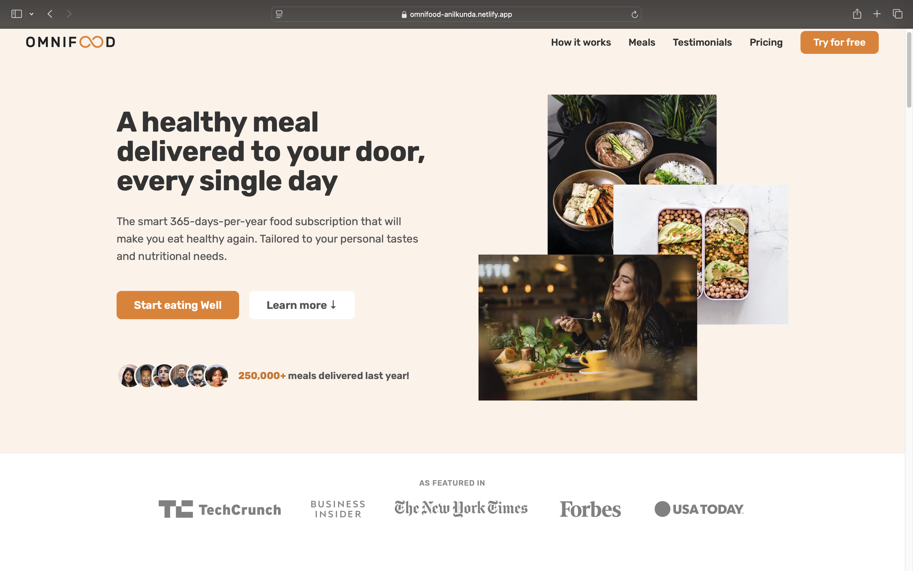

<div align="center">
  
  
  
  
 
  <br />

  <h2 align="center">Responsive OmniFood Website 🍽️</h2>

This project is crafted with care using Vite, vanilla JavaScript, HTML, and CSS. I’ve taken full advantage of flexbox and grid properties to create a seamless, visually stunning, and responsive design.

<a href="https://omnifood-anilkunda.netlify.app/"><strong>➥ Live Demo</strong></a>

</div>

### Demo Screeshots



### 🔥 Some key features of this effort include

- ✨ Experience smooth scrolling and subtle animations.
- 📱 Enjoy a fully functional mobile navigation button.
- 💻 Compatibility across all devices - mobiles, tablets, and laptops
- 🎨 A beautiful and user-friendly interface

### 🔧 Technologies Used

- Vite: Fast build tool for a smoother development experience ⚡
- Vanilla JavaScript: For interactive website behavior 💻
- HTML & CSS: Structure and styling 🌈
- Flexbox & Grid: To create a responsive layout 🌟

### 🚀 Getting Started

To run the project locally, follow these steps:

1. Clone the repository:

   ```bash
   git clone https://github.com/anillkunda/project_omnifood_website.git
   ```

2. Navigate to the project directory:

   ```bash
   cd project_omnifood_website
   ```

3. Install dependencies:

   ```bash
   npm install
   ```

4. Run the development server:

   ```bash
   npm run dev
   ```

5. Open the webpage in your browser at http://localhost:3000.

### 🤝 Contributing

Feel free to contribute to the project! You can report issues or submit pull requests to improve the codebase.

### 📜 License

This project is _free to use_ and does not contains any license.
